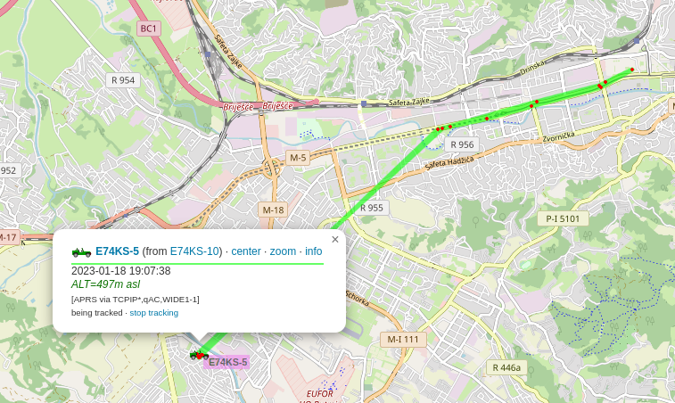

# LoRaWAN-APRS-Gateway

This one afternoon project, which enables connecting MQTT broker in order to fetch object location from LoRaWAN network (latitude, longitude and altitude). Location information is then forwarded to APRS-IS, so object can be tracked on [aprs.fi](https://aprs.fi/).

The script works with **The Things Network**, but it can be easily configured for other LoRaWAN networks.

## Installation
1. Configure parameters in **lorawanaprsgateway.py** (credentials for connecting MQTT broker, topic, credentials for connecting to   
APRS-IS, callsigns etc.).
2. Start the **lorawanaprsgateway.py**.
3. Follow tracked object on [aprs.fi](https://aprs.fi/).

File **htcc-ab02s.js** contains example of TTN payload formatter for module **Heltec CubeCell HTCC-AB02S** (with built-in GPS).
